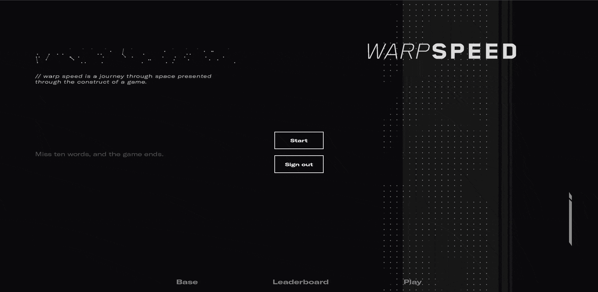

[![csivit][csivitu-shield]][csivitu-url]
[![Issues][issues-shield]][issues-url]

<!-- PROJECT LOGO -->
<br />
<p align="center">
  <a href="https://github.com/csivitu/warpspeed-frontend">
    
  </a>

  <h3 align="center">Warpspeed</h3>

  <p align="center">
    A journey through space presented through the construct of a game.  
    <br />
    <br />
    <a href="https://warpspeed.csivit.com">View Demo</a>
    ·
    <a href="https://github.com/csivitu/warpspeed-frontend/issues">Report Bug</a>
    ·
    <a href="https://github.com/csivitu/warpspeed-frontend/issues">Request Feature</a>
  </p>
</p>


<!-- TABLE OF CONTENTS -->
## Table of Contents

- [Table of Contents](#table-of-contents)
- [About The Project](#about-the-project)
  - [Built With](#built-with)
- [Getting Started](#getting-started)
  - [Prerequisites](#prerequisites)
  - [Installation](#installation)
- [Usage](#usage)
- [Contributing](#contributing)
- [License](#license)
- [Contributors](#contributors)


<!-- ABOUT THE PROJECT -->
## About The Project
<br>
<p align="center">
<a href="https://warpspeed.csivit.com">

</a>
</p>
<br>

Warpspeed is a fun typing game created for the event ["Devspace"](https://csivit.com/#events) during the year 2021


### Built With

* [React](https://reactjs.org/)
* [Node](https://nodejs.org/en/)
* [Express](https://expressjs.com/)


<!-- GETTING STARTED -->
## Getting Started

To get a local copy up and running follow these simple steps.

### Prerequisites

This is an example of how to list things you need to use the software and how to install them.
* npm
```sh
npm install npm@latest -g
```

### Installation
 
1. Clone the repo
```sh
git clone https://github.com/csivitu/warpspeed-frontend.git
```
2. Install NPM packages
```sh
npm install
```
3. Configure .env with your firebase config
```sh
#.env
REACT_APP_BASE_URL=
REACT_APP_FIREBASE_API_KEY=
REACT_APP_FIREBASE_AUTH_DOMAIN=
REACT_APP_FIREBASE_DATABASEURL=
REACT_APP_FIREBASE_PROJECT_ID=
REACT_APP_FIREBASE_STORAGE_BUCKET=
REACT_APP_FIREBASE_MESSAGINGID=
REACT_APP_FIREBASE_APP_ID=
```
4. Set up [Warpspeed-Backend](https://github.com/csivitu/WarpSpeed-Backend)
```sh
git clone https://github.com/csivitu/WarpSpeed-Backend.git
```

<!-- USAGE EXAMPLES -->
## Usage



https://user-images.githubusercontent.com/72266283/150697247-68d444f3-9acc-4b49-a99e-d21e92cadddb.mp4


<!-- ROADMAP -->


<!-- CONTRIBUTING -->
## Contributing

Contributions are what make the open source community such an amazing place to be learn, inspire, and create. Any contributions you make are **greatly appreciated**.

1. Fork the Project
2. Create your Feature Branch (`git checkout -b feature/AmazingFeature`)
3. Commit your Changes (`git commit -m 'feat: Add some AmazingFeature'`)
4. Push to the Branch (`git push -u origin feature/AmazingFeature`)
5. Open a Pull Request

You are requested to follow the contribution guidelines specified in [CONTRIBUTING.md](./CONTRIBUTING.md) while contributing to the project :smile:.

<!-- LICENSE -->
## License

Distributed under the MIT License. See [`LICENSE`](./LICENSE) for more information.


<!-- MARKDOWN LINKS & IMAGES -->
<!-- https://www.markdownguide.org/basic-syntax/#reference-style-links -->
[csivitu-shield]: https://img.shields.io/badge/csivitu-csivitu-blue
[csivitu-url]: https://csivit.com
[issues-shield]: https://img.shields.io/github/issues/csivitu/warpspeed-frontend.svg?style=flat-square
[issues-url]: https://github.com/csivitu/warpspeed-frontend/issues


## Contributors 

Thanks goes to these wonderful people:

<!-- ALL-CONTRIBUTORS-LIST:START - Do not remove or modify this section -->
<!-- prettier-ignore-start -->
<!-- markdownlint-disable -->
<table>
  <tr>
    <td align="center"><a href="https://github.com/sanjaybaskaran01"><br /><sub><b>Sanjay Baskaran</b></sub></a><br /><a href="https://github.com/csivitu/warpspeed-frontend/commits?author=sanjaybaskaran01" title="Code">💻</a> <a href="https://github.com/csivitu/warpspeed-frontend/commits?author=sanjaybaskaran01" title="Documentation">📖</a></td>
    <td align="center"><a href="https://github.com/rakeshprask"><br /><sub><b>Rakesh Prasanna</b></sub></a><br /><a href="https://github.com/csivitu/warpspeed-frontend/commits?author=rakeshprask" title="Code">💻</a> <a href="https://github.com/csivitu/warpspeed-frontend/commits?author=rakeshprask" title="Documentation">📖</a></td>
  </tr>
</table>